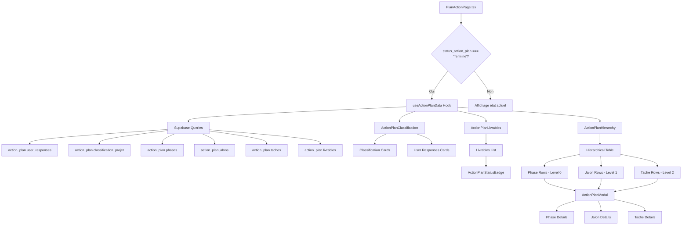
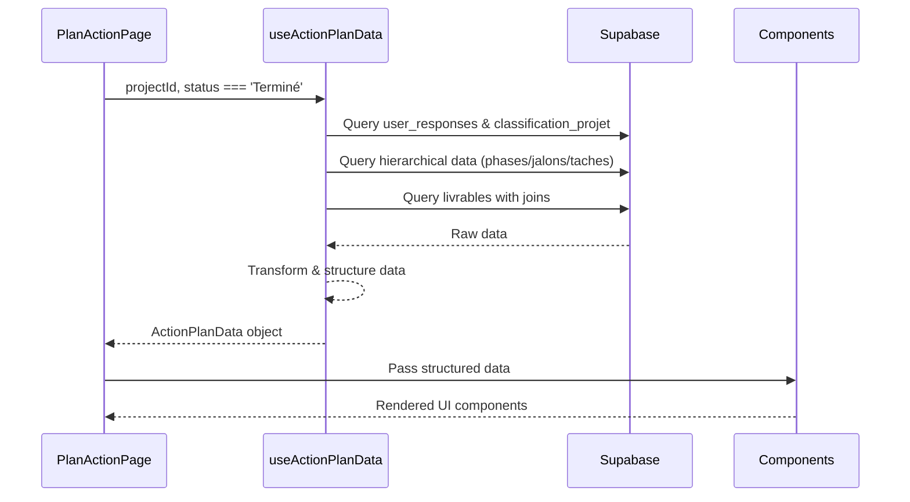
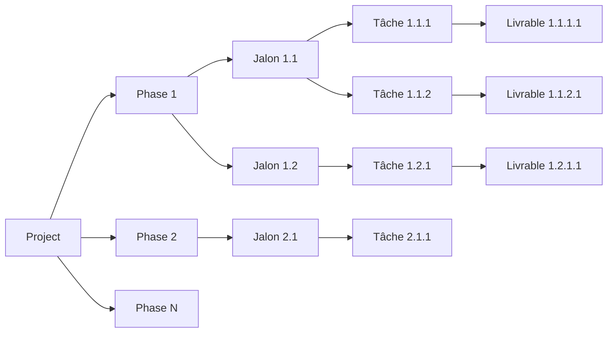
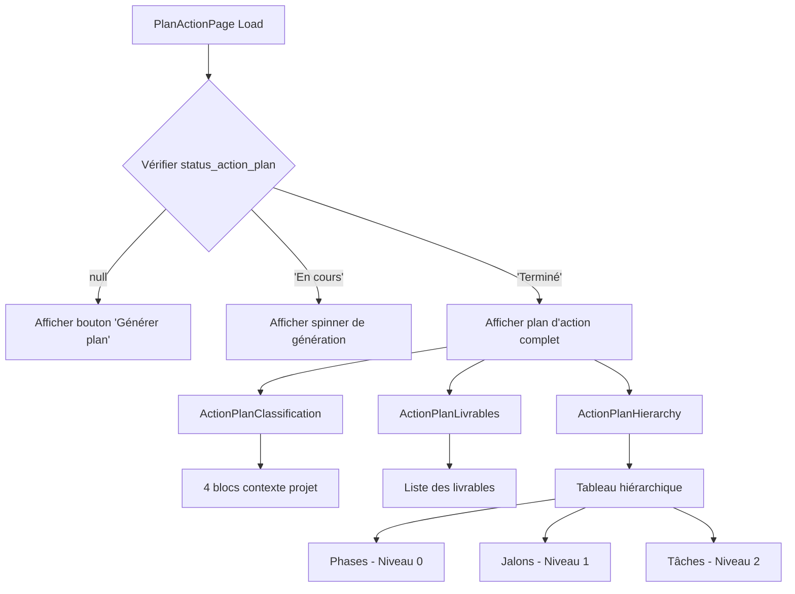
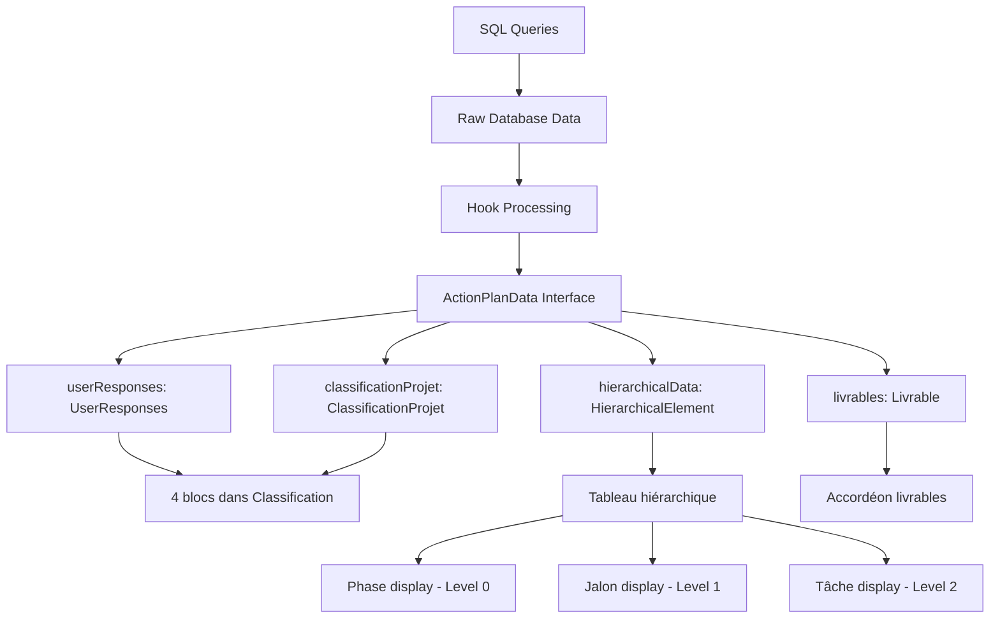
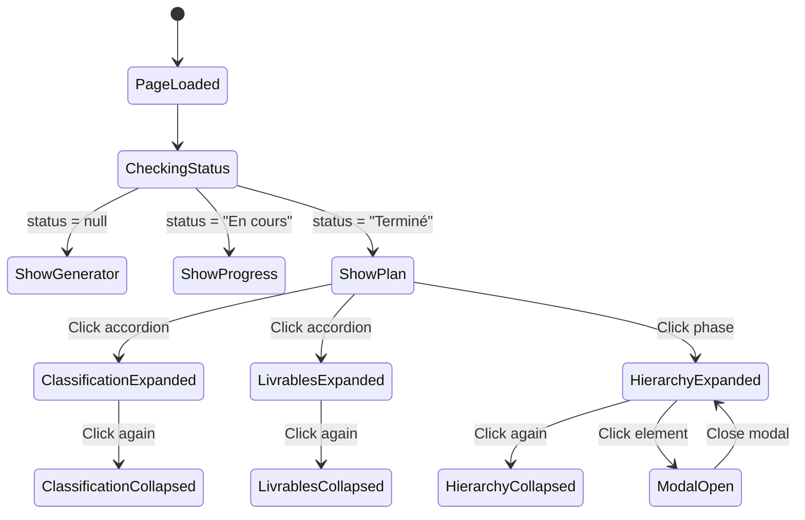

# Architecture du Plan d'Action - Diagrammes

## Diagramme d'Architecture des Composants

## Flux de Données

## Structure Hiérarchique des Données

## États d'Affichage selon Status

## Mapping des Données SQL vers Interface

## Interactions Utilisateur

Cette architecture modulaire et hiérarchique permet une implémentation progressive et maintient la séparation des responsabilités tout en offrant une expérience utilisateur fluide et intuitive.